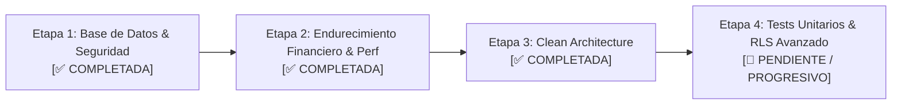

# Plan de Trabajo y Próximos Pasos — Canada School

Este documento contiene la hoja de ruta integral de trabajo, el estado de avance de cada fase y las tareas pendientes para continuar el desarrollo o responder a nuevos requisitos del mentor/cliente.

---

## 📊 Estado de Avance por Etapas



---

## ✅ Etapa 1: Seguridad, Integridad y Base de Datos (Completada)
- [x] Corregir la inyección SQL en la función PostgreSQL `buscar_alumnos(q text)`.
- [x] Crear migración incremental `supabase/migrations/0002_fix_sqli_and_indexes.sql`.
- [x] Definir índices en claves foráneas y columnas de filtro frecuente (`idx_alumnos_tutor_id`, `idx_cuotas_alumno_id`, `idx_cuotas_estado`, `idx_pagos_cuota_id`).

---

## ✅ Etapa 2: Endurecimiento de Lógica Financiera & Performance (Completada)
- [x] Eliminar las 800 consultas secuenciales HTTP (N+1) en carga inicial.
- [x] Corregir la regla de hermanos: agrupar por `tutor_id` (familia real) en lugar de coincidencia de apellido textual.
- [x] Corregir aumento por inflación: aplicar el 15% estrictamente a cuotas pendientes sin alterar recibos históricos.
- [x] Resolver la pérdida de precisión por punto flotante (`0.10 + 0.20 !== 0.30`) en `estaCuotaSaldada`.
- [x] Corregir cálculo de mora respetando vencimiento calendario.
- [x] Limpiar fugas de memoria (`setInterval` sin cleanup en React) y mutaciones directas de estado.

---

## ✅ Etapa 3: Refactorización a Clean Architecture (Completada)
- [x] Diseñar y construir `domain/` (100% puro, sin dependencias externas):
  - Value Object inmutable `Dinero`.
  - Entidades y tipos de dominio (`types.ts`).
  - Funciones de cálculo puro (`reglasNegocio.ts`).
- [x] Diseñar y construir `application/`:
  - Puertos / Interfaces abstractas (`ports/repositories.ts`).
  - Casos de uso (`ObtenerDashboardUseCase`, `AplicarAumentoGeneralUseCase`, `RegistrarPagoUseCase`, `CrearAlumnoUseCase`).
- [x] Diseñar y construir `infrastructure/`:
  - Repositorios de Supabase (`SupabaseAlumnoRepository`, `SupabaseCuotaRepository`, `SupabasePagoRepository`, `SupabaseTutorRepository`).
  - Mapeadores DTO ↔ Dominio y paginador concurrente.
- [x] Inyección de dependencias (`container.ts`).
- [x] Diseñar y construir `presentation/`:
  - Custom Hook orquestador (`useDashboard.ts`).
  - Componentes limpios (`TablaAlumnos`, `FormNuevoAlumno`, `ContactoModal`).
  - Contenedor de UI desacoplado de la base de datos (`AdminDashboard.tsx`).
- [x] Validación de la Regla de Dependencias con script de fitness function (`check-architecture.ts`).

---

## 📌 Etapa 4: Próximos Pasos para Continuar

Para continuar el proyecto o prepararlo para revisiones adicionales del mentor, se recomiendan los siguientes ítems:

### 1. Suite de Pruebas Automatizadas (Vitest)
- [ ] Instalar Vitest en `app/`:
  ```bash
  npm i -D vitest
  ```
- [ ] Agregar tests unitarios para las reglas de negocio puras en `src/domain/`:
  - `Dinero.test.ts`: Suma, resta, multiplicación por factor, prevención de desbordes decimales.
  - `reglasNegocio.test.ts`:
    - Descuentos por 1, 2, 3+ hermanos.
    - Cuota saldada con pagos parciales (`0.10 + 0.20 == 0.30`).
    - Cálculo de mora por días transcurridos.
- [ ] Agregar tests unitarios para los casos de uso en `src/application/useCases/` utilizando repositorios mock en memoria (sin tocar Supabase).

### 2. Autenticación Real y Políticas RLS
- [ ] Reemplazar el login simulado (`Login.tsx`) por autenticación real con Supabase Auth (`supabase.auth.signInWithPassword`).
- [ ] Configurar tabla de perfiles de usuario vinculada a `auth.users` con columna de `rol` (`admin`, `secretaria`, `tutor`).
- [ ] Implementar políticas de Row Level Security (RLS) en PostgreSQL para restringir el acceso:
  - Tutores: Solo pueden ver sus propios alumnos, cuotas y pagos.
  - Secretaria: Puede registrar pagos y alumnos.
  - Admin: Acceso total y capacidad de aplicar aumentos.

### 3. Vistas Específicas por Rol
- [ ] Crear el panel del tutor (portal donde el tutor ve únicamente el estado de cuenta y cuotas de sus hijos).
- [ ] Restringir acciones sensibles (como el botón "Aplicar aumento 15%") para que solo esté habilitado si el usuario tiene rol de administrador.
